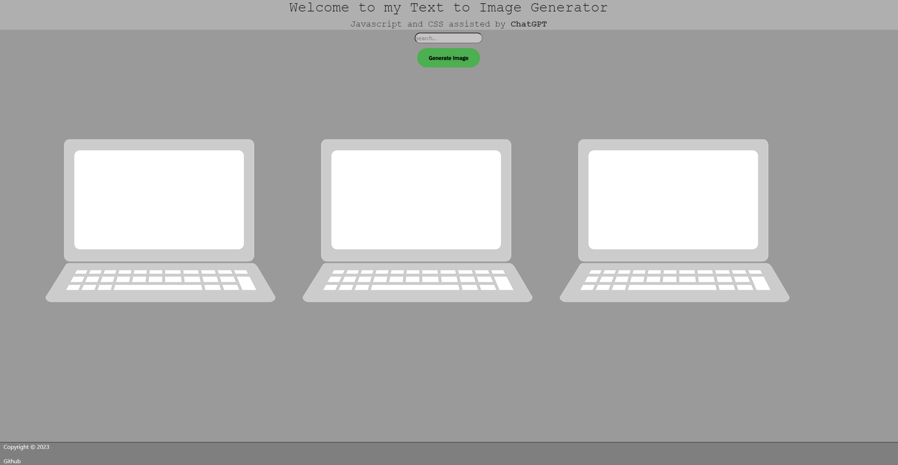

# ImageAiGenerator

ImageAiGenerator is a simple website designed to work with OpenAi's image generating api. The website will take any text and generate a brand new image related to what was inputted in the text field.

## - To use this website make sure to create your own api key from https://platform.openai.com/docs/guides/images/image-generation-beta and insert it in the search.js code

## -

## Webpage on Arrival
## -

## Webpage after having loaded an Image
## -

